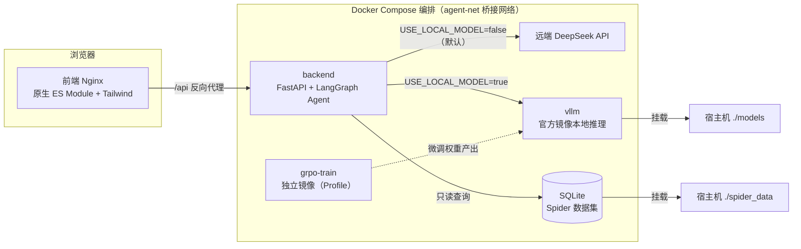

# SQL Mind Agent — Text2SQL 多步骤智能问答 Agent

基于 LangGraph 构建的 Text2SQL 智能问答系统，支持将复杂自然语言问题拆解为多个 SQL 子任务，执行查询后聚合反思，最终生成可信的自然语言答案。

本项目采用 Docker Compose 完成多服务容器编排，包含前端静态服务、Agent 推理后端、vLLM 大模型推理服务，支持一键拉起完整对话应用。

工程层面做环境职责隔离：

- Agent 在线推理服务与 GRPO 强化学习训练代码目录分离，两套独立 Docker 运行环境，避免训练重型依赖增加推理镜像体积；
- vLLM 推理服务基于官方镜像部署，仓库仅维护编排配置，不存储镜像、模型权重；模型文件通过宿主机目录挂载方式共享；
- 默认启动远端模型对话推理链路，本地 vLLM 推理、GRPO 训练作为可选扩展能力，通过 Compose Profile 按需启动。

## 架构



主图链路：

```
用户问题 → plan(任务拆解) → dispatch(并行执行子任务) → aggregate(聚合结果) → reflect(审查反思)
                                          ↓                                ├── passed → finalize → 最终答案
                              每个子任务: generate→validate→execute→retry  ├── 未达上限 → retry(重规划)
                                                                         └── 达上限 → degrade(降级回答)
```

## 快速开始（Docker Compose 部署）

### 1. 准备环境变量

```bash
cp .env.example .env
# 编辑 .env，填入 LLM_API_KEY 等
```

### 2. 准备本地模型（仅本地 vLLM / GRPO 训练需要，远端模式可跳过）

```bash
git clone https://huggingface.co/Qwen/Qwen2.5-Coder-3B-Instruct ./models/Qwen2.5-Coder-3B-Instruct
```

### 3. 默认模式（frontend + backend，走远端 DeepSeek，无 GPU 也能跑）

```bash
docker compose up -d --build
# 浏览器访问 http://localhost:8080
```

### 4. 本地 vLLM 推理（需 GPU；先把 .env 的 USE_LOCAL_MODEL 改为 true）

```bash
docker compose --profile vllm up -d
```

### 5. GRPO 训练（需 GPU，可选扩展）

```bash
docker compose --profile train up -d
# 训练产物输出到 grpo-train/saves/
```

### 6. 停止 / 清理

```bash
docker compose down
docker compose --profile vllm --profile train down
```

## 工程设计亮点

- **前端零构建**：浏览器原生 ES Module 多文件拆分（`api.js` / `chatStore.js` / `uiRender.js` / `main.js`），Nginx 托管 + `/api` 反向代理解决跨域，后端无需开启 CORS，无 Node 编译打包；
- **SSE 流式通信**：Nginx 关闭缓冲、延长超时，实时推送「规划 → 调度 → 聚合 → 反思」每步进度；
- **Profile 按需加载**：默认 `docker compose up` 仅启动 frontend + backend；`--profile vllm` 启用本地推理，`--profile train` 启用训练；
- **健康检查 + 重启策略 + GPU 资源声明 + 环境变量统一读取 .env**，SQLite 运行数据经 `./data` 卷持久化；
- **自定义桥接网络 agent-net**，容器内以服务名相互通信。

## API 接口

### `GET /health`

健康检查。

```bash
curl http://localhost:8000/health
```

**响应:** `{"status": "ok"}`

### `POST /query`（同步）

```bash
curl -X POST http://localhost:8000/query \
  -H "Content-Type: application/json" \
  -d '{"question": "Customers 表有多少条记录？", "db_id": "department_store"}'
```

| 响应字段 | 类型 | 说明 |
|------|------|------|
| `trace_id` | `str` | 链路追踪 ID |
| `final_answer` | `str\|null` | 最终自然语言答案 |
| `status` | `str` | `done` / `degraded` / `error` |
| `plan` | `list[dict]` | 执行计划（子任务列表） |
| `iterations` | `int` | 实际迭代轮次（含重试） |

### `GET /query/stream`（SSE 流式）

```bash
curl -N "http://localhost:8000/query/stream?question=Customers表有多少条记录&db_id=department_store"
```

| event | payload | 说明 |
|-------|---------|------|
| `start` | `{"trace_id": "..."}` | 连接建立 |
| `node_done` | `{"node": "plan", "label": "正在规划", "payload": {...}}` | 单节点完成 |
| `done` | `{"trace_id": "...", "final_answer": "...", "status": "done", ...}` | 全部完成 |
| `error` | `{"trace_id": "...", "error": "..."}` | 执行异常 |

`node` 取值：`plan` / `dispatch` / `aggregate` / `reflect` / `finalize` / `degrade`

## CLI 使用

```bash
# 在 backend/ 目录下
cd backend
python main.py --question "Customers 表有多少条记录？" --db_id department_store
python main.py --demo
```

## 项目结构

```
sql-mind-agent/
├── docker-compose.yml        # Compose 编排（frontend+backend 默认；vllm/train 按 Profile）
├── .env.example              # 环境变量模板
├── .gitignore
├── README.md
├── frontend/                 # 前端静态服务（Nginx，原生 ES Module）
│   ├── Dockerfile
│   ├── nginx.conf            # /api 反向代理到 backend，解决跨域
│   ├── index.html
│   ├── js/                   # api.js / chatStore.js / uiRender.js / main.js
│   ├── css/main.css
│   └── assets/
├── backend/                  # Agent 在线推理后端（FastAPI + LangGraph）
│   ├── Dockerfile
│   ├── requirements.txt
│   ├── api.py                # FastAPI 入口
│   ├── main.py               # CLI 入口
│   ├── evaluate.py           # 批量评估
│   ├── run_soul_case.py      # 灵魂 Case 演示
│   ├── app/                  # 核心 Agent 包
│   └── tests/                # pytest 单元测试
├── grpo-train/               # GRPO 训练（独立镜像，Profile 按需启动）
│   ├── Dockerfile
│   ├── requirements.txt
│   └── train/
├── spider_data/              # Spider 数据集与 SQLite 库（宿主机只读挂载）
├── models/                   # 本地 vLLM 模型权重（宿主机挂载，gitignore）
└── data/                     # 运行时 SQLite 数据（traces.db 持久化，gitignore）
```

## 本地开发

```bash
# 后端依赖（在 backend/ 目录下）
cd backend
pip install -r requirements.txt -r requirements-dev.txt

# 运行测试
python -m pytest tests/ -v

# 代码检查
ruff check .
mypy app/
```

> 本地运行后端时，`.env` 可放在仓库根（与 Docker Compose 共用）或 `backend/.env`；`SPIDER_DB_ROOT` 相对路径按仓库根解析，即 `./spider_data/database`。
