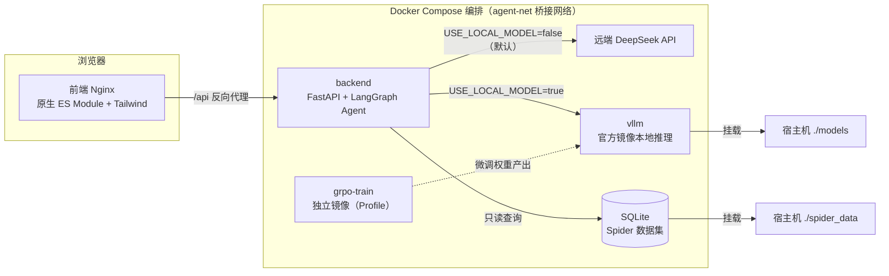
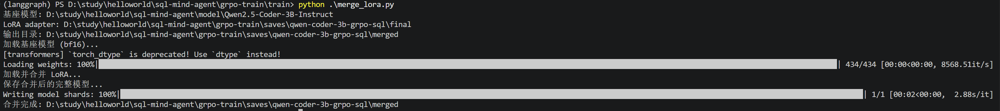
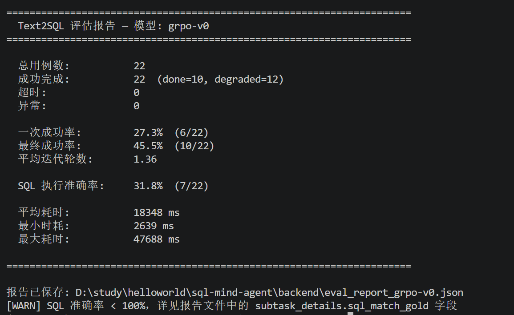
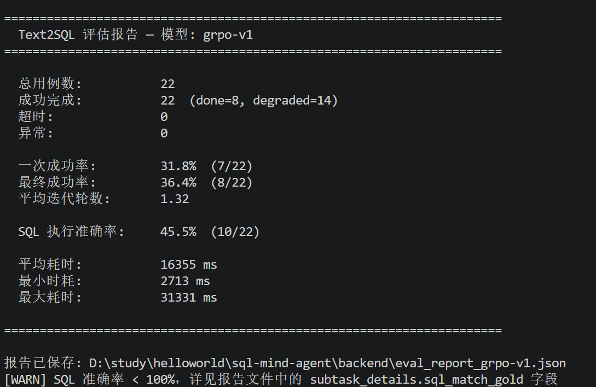

# SQL Mind Agent — Text2SQL 多步骤智能问答 Agent

[](https://github.com/wz1498090183/sql-mind-agent/actions)
[](https://www.python.org/)
[](LICENSE)
[](https://github.com/langchain-ai/langgraph)
[](https://github.com/vllm-project/vllm)
[](https://arxiv.org/abs/2402.03300)

基于 LangGraph 构建的 Text2SQL 智能问答系统，支持将复杂自然语言问题拆解为多个 SQL 子任务，执行查询后聚合反思，最终生成可信的自然语言答案。

## 核心亮点

- **多智能体任务编排**：Plan-Execute-Reflect 架构，将复杂问题拆解为带依赖关系的子任务 DAG，拓扑分层后层内并行、层间串行，并检测依赖环；
- **SQL 自修复闭环**：每个子任务走「生成 → 四层校验 → 执行 → 失败重试」闭环，静态校验（语法 / 高危关键字 / 表名 / 列名拼写 / 上游 id 误用）与执行反馈双重兜底；
- **值检索 + 检索式 few-shot**：抽取低基数类别列的样本值注入 Prompt 提升实体匹配，按问题相似度动态检索历史 SQL 示例替代静态 few-shot；
- **三级兜底评估**：SQL 结果等价比较「字段一致看值 → 字段不一致看无序集合 → 大模型语义判断」，能识别不同列名/列序/行序下的等价结果并给出自然语言诊断；
- **GRPO 强化学习微调**：以「SQL 可执行 + 格式合规」为奖励信号训练 LoRA，合并回基座模型供 vLLM 部署（对标 sqlcoder 小模型路线）；
- **安全与可靠性**：只读 SQL 拦截（仅 SELECT/WITH），请求/子任务/LLM/SQLite 四层超时，全链路 trace 落库便于 badcase 排查。

## 架构



主图链路：

```
用户问题 → plan(任务拆解) → dispatch(并行执行子任务) → aggregate(聚合结果) → reflect(审查反思)
                                          ↓                                ├── passed → finalize → 最终答案
                              每个子任务: generate→validate→execute→retry  ├── 未达上限 → retry(重规划)
                                                                         └── 达上限 → degrade(降级回答)
```

## 量化效果

### GRPO 强化学习微调
基于 Spider 数据集的 `department_store` 业务库，以「SQL 执行结果正确性 + 输出格式合规性」构建奖励函数，在1个epoch内完成GRPO微调，共7个batch（每8条样本执行一次策略更新），记录每个batch平均奖励如下：

| Batch序号 | 1 | 2 | 3 | 4 | 5 | 6 | 7 |
|----------|---|---|---|---|---|---|---|
| 总奖励（均值） | 0.16 | 0.66 | 0.58 | 0.53 | 0.71 | 0.78 | 0.48 |
| SQL执行奖励（均值） | -0.04 | 0.46 | 0.38 | 0.33 | 0.51 | 0.58 | 0.28 |

> 说明：奖励为单batch内样本均值，整体呈现先上升、后期小幅回落的趋势；核心优化效果以下方离线评估集的SQL执行准确率为准。

### 评估指标体系

`backend/evaluate.py` 对评估集逐条跑完整 Agent，输出结构化指标：

### 微调效果对比评估
通过自研评估脚本 `backend/evaluate.py` 运行完整 Agent 反思链路，在固定22条评估集（覆盖简单聚合、多表 JOIN、嵌套子查询、UNION 联合查询等多难度场景）上，对比基线与GRPO微调后版本的端到端效果：

| 评估指标 | grpo-v0（基线版本） | grpo-v1（GRPO 微调后） | 变化情况 |
|----------|---------------------|-----------------------|----------|
| SQL 执行准确率 | 31.8%（7/22） | 45.5%（10/22） | **提升 13.7 个百分点** |
| 一次生成成功率 | 27.3%（6/22） | 31.8%（7/22） | 提升 4.5 个百分点 |
| 最终完全达标率（done） | 45.5%（10/22） | 36.4%（8/22） | 下降 9.1 个百分点 |
| 平均反思迭代轮数 | 1.36 | 1.32 | 减少 0.04 轮 |
| 单例平均推理耗时 | 18348 ms | 16355 ms | 缩短 1993 ms，提速约 10.9% |

#### 指标说明
- **SQL 执行准确率**：核心质量指标。通过三级兜底判定逻辑，校验生成 SQL 的执行结果与标准答案 `gold_sql` 是否语义等价，是 Text2SQL 任务的核心评判标准。
- **一次生成成功率**：模型首轮输出即通过校验、无需进入反思纠错流程的用例占比，反映模型原生生成质量。
- **最终完全达标率**：Agent 迭代结束后状态标记为 `done` 的用例占比；其余 `degraded` 状态为降级输出，仍可返回可用的查询结果。
- **平均反思迭代轮数**：Agent 调用反思工具重试的平均次数，数值越低代表模型首轮生成质量越可靠。

> 补充说明：GRPO微调后核心SQL语义准确率显著提升，推理耗时同步优化；完全达标率小幅下降，源于奖励函数优先侧重SQL执行结果正确性。

评估集位于 `backend/data/eval_set.json`（22 条，取自 Spider benchmark 的 department_store 数据库，覆盖简单聚合 / 多表 JOIN / 子查询 / UNION 等难度），运行 `python evaluate.py` 生成完整报告（含逐条 SQL diff 对比）。

## 快速开始（Docker Compose 部署）

### 1. 准备环境变量

```bash
cp .env.example .env
# 编辑 .env，填入 LLM_API_KEY 等
```

### 2. 准备本地模型（仅本地 vLLM / GRPO 训练需要，远端模式可跳过）

```bash
git clone https://huggingface.co/Qwen/Qwen2.5-Coder-3B-Instruct ./models/Qwen2.5-Coder-3B-Instruct
```

### 3. 默认模式（frontend + backend，走远端 DeepSeek，无 GPU 也能跑）

```bash
docker compose up -d --build
# 浏览器访问 http://localhost:8080
```

### 4. 本地 vLLM 推理（需 GPU；先把 .env 的 USE_LOCAL_MODEL 改为 true）

```bash
docker compose --profile vllm up -d
```

### 5. GRPO 训练（需 GPU，可选扩展）

```bash
docker compose --profile train up -d
# 训练产物输出到 grpo-train/saves/
```

### 6. 合并 LoRA（训练后，供 vLLM 部署）

GRPO 训练只产出 LoRA adapter（`grpo-train/saves/qwen-coder-3b-grpo-sql/final/`），vLLM 无法直接加载，需先合并回基座模型：

```bash
cd grpo-train
python train/merge_lora.py
```

合并产物（完整 bf16 权重 + tokenizer）输出到 `grpo-train/saves/qwen-coder-3b-grpo-sql/merged/`，把它放入宿主机模型目录并让 vLLM 指向它：

```bash
cp -r grpo-train/saves/qwen-coder-3b-grpo-sql/merged ./models/qwen-coder-3b-grpo-sql
```

在 `.env` 中把 vLLM 指向合并后的模型（`VLLM_MODEL_NAME` 即 served 名，需与 `LOCAL_LLM_MODEL` 一致）：

```dotenv
VLLM_MODEL_PATH=/models/qwen-coder-3b-grpo-sql
VLLM_MODEL_NAME=qwen-coder-3b-grpo-sql
LOCAL_LLM_MODEL=qwen-coder-3b-grpo-sql
```

再按第 4 步（`USE_LOCAL_MODEL=true`）启动 vLLM 即可走本地合并模型推理。

### 7. 停止 / 清理

```bash
docker compose down
docker compose --profile vllm --profile train down
```

## 工程设计亮点

- **前端零构建**：浏览器原生 ES Module 多文件拆分（`api.js` / `chatStore.js` / `uiRender.js` / `main.js`），Nginx 托管 + `/api` 反向代理解决跨域，后端无需开启 CORS，无 Node 编译打包；
- **SSE 流式通信**：Nginx 关闭缓冲、延长超时，实时推送「规划 → 调度 → 聚合 → 反思」每步进度；
- **Profile 按需加载**：默认 `docker compose up` 仅启动 frontend + backend；`--profile vllm` 启用本地推理，`--profile train` 启用训练；
- **健康检查 + 重启策略 + GPU 资源声明 + 环境变量统一读取 .env**，SQLite 运行数据经 `./backend/data` 卷持久化；
- **自定义桥接网络 agent-net**，容器内以服务名相互通信。

## 评估亮点

SQL 执行准确率评估采用三级兜底比较，能识别不同列名、列序、行序下的等价结果，最终给出自然语言诊断：

1. **字段一致 → 看值**：两边列名集合一致时，按列名对齐后精确比较值（消除列序差异）；
2. **字段不一致 → 看无序集合**：列名不一致时，忽略列名/列序/行序，比较单元格值的多重集合；
3. **仍不一致 → 大模型判断**：前两层都不一致时，调用 LLM 判断两个结果是否语义等价，并给出自然语言诊断（等价/不等价 + 简要说明）。

## API 接口

### `GET /health`

健康检查。

```bash
curl http://localhost:8000/health
```

**响应:** `{"status": "ok"}`

### `POST /query`（同步）

```bash
curl -X POST http://localhost:8000/query \
  -H "Content-Type: application/json" \
  -d '{"question": "Customers 表有多少条记录？", "db_id": "department_store"}'
```

| 响应字段 | 类型 | 说明 |
|------|------|------|
| `trace_id` | `str` | 链路追踪 ID |
| `final_answer` | `str\|null` | 最终自然语言答案 |
| `status` | `str` | `done` / `degraded` / `error` |
| `plan` | `list[dict]` | 执行计划（子任务列表） |
| `iterations` | `int` | 实际迭代轮次（含重试） |

### `GET /query/stream`（SSE 流式）

```bash
curl -N "http://localhost:8000/query/stream?question=Customers表有多少条记录&db_id=department_store"
```

| event | payload | 说明 |
|-------|---------|------|
| `start` | `{"trace_id": "..."}` | 连接建立 |
| `node_done` | `{"node": "plan", "label": "正在规划", "payload": {...}}` | 单节点完成 |
| `done` | `{"trace_id": "...", "final_answer": "...", "status": "done", ...}` | 全部完成 |
| `error` | `{"trace_id": "...", "error": "..."}` | 执行异常 |

`node` 取值：`plan` / `dispatch` / `aggregate` / `reflect` / `finalize` / `degrade`

## CLI 使用

```bash
# 在 backend/ 目录下
cd backend
python main.py --question "Customers 表有多少条记录？" --db_id department_store
python main.py --demo
```

## 项目结构

```
sql-mind-agent/
├── .github/workflows/ci.yml  # GitHub Actions CI（pytest + ruff + mypy）
├── docker-compose.yml        # Compose 编排（frontend+backend 默认；vllm/train 按 Profile）
├── .env.example              # 环境变量模板
├── README.md
├── docs/                     # 文档（架构与设计决策 / 效果截图）
│   └── ARCHITECTURE.md
├── frontend/                 # 前端静态服务（Nginx，原生 ES Module）
│   ├── Dockerfile
│   ├── nginx.conf            # /api 反向代理到 backend，解决跨域
│   ├── index.html
│   ├── js/                   # api.js / chatStore.js / uiRender.js / main.js
│   ├── css/main.css
│   └── assets/
├── backend/                  # Agent 在线推理后端（FastAPI + LangGraph）
│   ├── Dockerfile
│   ├── requirements.txt
│   ├── api.py                # FastAPI 入口
│   ├── main.py               # CLI 入口
│   ├── evaluate.py           # 批量评估（三级兜底 + 多维度指标）
│   ├── run_soul_case.py      # 灵魂 Case 演示
│   ├── app/                  # 核心 Agent 包（graph / nodes / sql_subgraph / fewshot 等）
│   ├── data/                 # 运行时 SQLite（traces.db）+ 评估集 eval_set.json + 示例池 fewshot_pool.json
│   └── tests/                # pytest 单元测试
├── grpo-train/               # GRPO 训练（独立镜像，Profile 按需启动）
│   ├── Dockerfile
│   ├── requirements.txt
│   ├── saves/                # 训练产物（checkpoint / LoRA adapter，gitignore）
│   └── train/
├── spider_data/              # Spider 数据集与 SQLite 库（宿主机只读挂载）
└── models/                   # 本地 vLLM 模型权重（宿主机挂载，gitignore）
```

## 本地开发

```bash
# 后端依赖（在 backend/ 目录下）
cd backend
pip install -r requirements.txt -r requirements-dev.txt

# 运行测试
python -m pytest tests/ -v

# 代码检查
ruff check .
mypy app/
```

> 本地运行后端时，`.env` 可放在仓库根（与 Docker Compose 共用）或 `backend/.env`；`SPIDER_DB_ROOT` 相对路径按仓库根解析，即 `./spider_data/database`。

## 相关文档

- [架构与设计决策](docs/ARCHITECTURE.md)：双层图设计、反思机制、三级兜底、GRPO 选型等关键权衡。

## 应用效果示例


## 模型效果示例


### grpo前后


