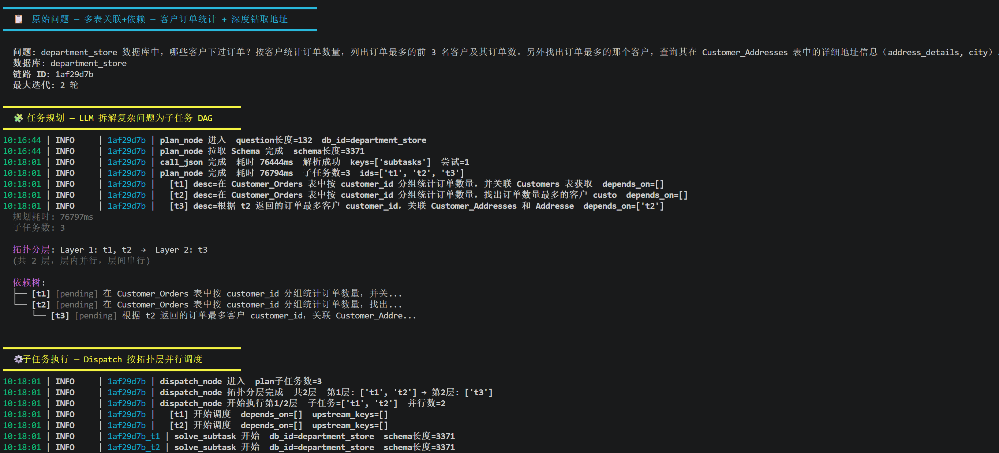
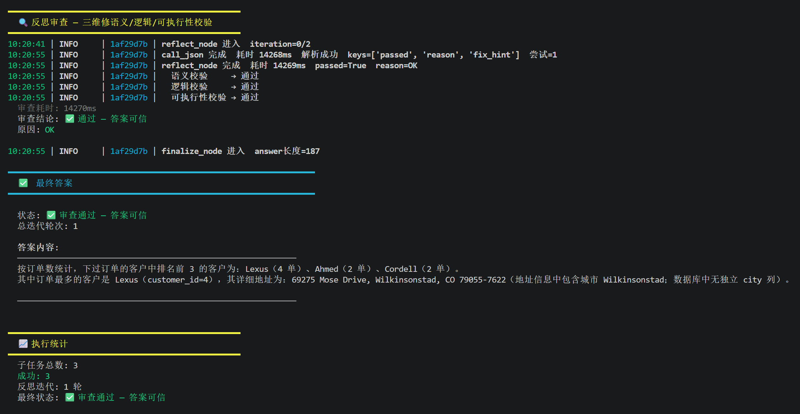
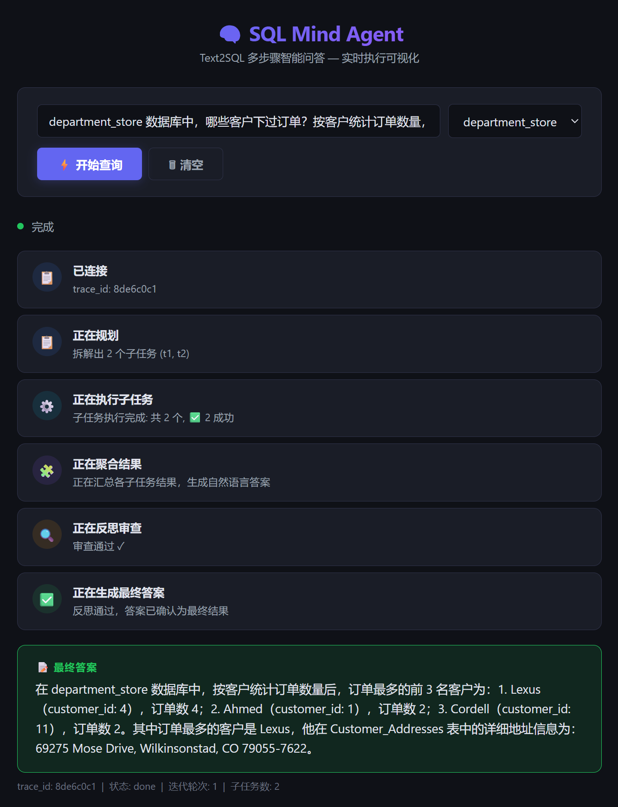
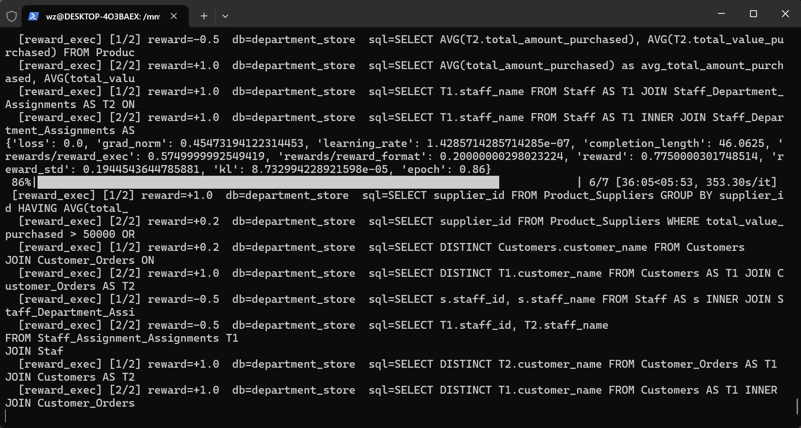

# SQL Mind Agent — Text2SQL 多步骤智能问答 Agent

基于 LangGraph 构建的 Text2SQL 智能问答系统，支持将复杂自然语言问题拆解为多个 SQL 子任务，执行查询后聚合反思，最终生成可信的自然语言答案。

## 架构

```
用户问题 → plan(任务拆解) → dispatch(并行执行子任务) → aggregate(聚合结果) → reflect(审查反思)
                                          ↓                                ├── passed → finalize → 最终答案
                              每个子任务: generate→validate→execute→retry  ├── 未达上限 → retry(重规划)
                                                                         └── 达上限 → degrade(降级回答)
```

## 快速开始

### 1. 环境要求

- Python 3.12
- SQLite 数据库（Spider 格式）

### 2. 安装依赖

```bash
pip install -r requirements.txt
```

### 3. 配置 .env

将 `.env.example` 复制为 `.env`，按需修改：

```env
# 远端 API 模型（USE_LOCAL_MODEL=false 时使用）
LLM_API_KEY=your-api-key
LLM_BASE_URL=https://api.deepseek.com
LLM_MODEL=deepseek-v4-pro

# 本地 vLLM 模型（USE_LOCAL_MODEL=true 时使用）
LOCAL_LLM_API_KEY=EMPTY
LOCAL_LLM_BASE_URL=http://localhost:8000/v1
LOCAL_LLM_MODEL=Qwen2.5-Coder-3B-Instruct

# 模型切换开关：true 用本地 vLLM，false 用远端 API
USE_LOCAL_MODEL=false

SPIDER_DB_ROOT=./spider/database
```

> 切换本地模型：将 `USE_LOCAL_MODEL` 改为 `true`，并确保 vLLM 服务已启动（如 `vllm serve Qwen/Qwen2.5-Coder-3B-Instruct --port 8000`）。

### 4. 启动 Web 服务

```bash
# 方式一: 直接运行
python api.py

# 方式二: 使用 uvicorn
uvicorn api:app --host 127.0.0.1 --port 8000 --reload
```

## API 接口

### `GET /health`

健康检查。

```bash
curl http://127.0.0.1:8000/health
```

**响应:** `{"status": "ok"}`

---

### `POST /query` (同步)

运行完整多步骤 Text2SQL 流程，返回最终答案。

```bash
curl -X POST http://127.0.0.1:8000/query \
  -H "Content-Type: application/json" \
  -d '{"question": "Customers 表有多少条记录？", "db_id": "department_store"}'
```

**请求体:**

| 字段 | 类型 | 说明 |
|------|------|------|
| `question` | `str` | 用户自然语言问题 |
| `db_id` | `str` | 目标数据库标识符 |

**响应体:**

| 字段 | 类型 | 说明 |
|------|------|------|
| `trace_id` | `str` | 链路追踪 ID |
| `final_answer` | `str\|null` | 最终自然语言答案 |
| `status` | `str` | 状态: `done` / `degraded` / `error` |
| `plan` | `list[dict]` | 执行计划（子任务列表） |
| `iterations` | `int` | 实际迭代轮次（含重试） |

---

### `GET /query/stream` (SSE 流式)

实时 SSE 流式推送每一步进度，前端可据此展示进度条/步骤指示器。

```bash
curl -N "http://127.0.0.1:8000/query/stream?question=Customers表有多少条记录&db_id=department_store"
```

**查询参数:**

| 参数 | 类型 | 说明 |
|------|------|------|
| `question` | `str` | 用户自然语言问题 |
| `db_id` | `str` | 目标数据库标识符 |

**事件流:**

| event | payload | 说明 |
|-------|---------|------|
| `start` | `{"trace_id": "..."}` | 连接建立，返回追踪 ID |
| `node_done` | `{"node": "plan", "label": "正在规划", "status": "completed", "payload": {...}}` | 单个节点完成 |
| `done` | `{"trace_id": "...", "final_answer": "...", "status": "done", ...}` | 全部流程完成 |
| `error` | `{"trace_id": "...", "error": "..."}` | 执行异常 |

`node_done` 事件中的 `node` 可能取值: `plan` / `dispatch` / `aggregate` / `reflect` / `finalize` / `degrade`

---

## CLI 使用

```bash
# 命令行直接查询
python main.py --question "Customers 表有多少条记录？" --db_id department_store

# 运行内置演示 Demo
python main.py --demo
```


## 项目结构

```
sql-mind-agent/
├── main.py              # 命令行入口
├── api.py               # FastAPI 服务入口
├── evaluate.py          # 批量评估脚本
├── run_soul_case.py     # 灵魂 Case 演示脚本
├── .env / .gitignore / CLAUDE.md / README.md
├── app/                 # ← 核心代码
│   ├── state.py         #   状态定义
│   ├── graph.py         #   主图编排
│   ├── nodes.py         #   6 个节点实现
│   ├── sql_subgraph.py  #   SQL 求解子图
│   ├── llm_client.py    #   LLM 客户端
│   ├── db_utils.py      #   数据库工具
│   ├── log_utils.py     #   日志工具
│   ├── trace_store.py   #   链路追踪落库
│   └── static/
│       └── index.html   #   前端页面
├── data/
│   └── eval_set.json    #   评估用例
├── train/               # GRPO 训练（独立模块）
├── tests/               # pytest 单元测试
├── tools/               # 辅助工具
├── spider/              # Spider 数据库
└── spider_data/         # Spider 原始数据

```

## 开发

### 运行测试

```bash
pip install -r requirements-dev.txt
python -m pytest tests/ -v
```

### 代码质量

```bash
# 代码检查
ruff check .

# 类型检查
mypy app/
```

### Docker 部署

```bash
docker build -t sql-mind-agent .
docker run -p 8000:8000 --env-file .env sql-mind-agent
```




